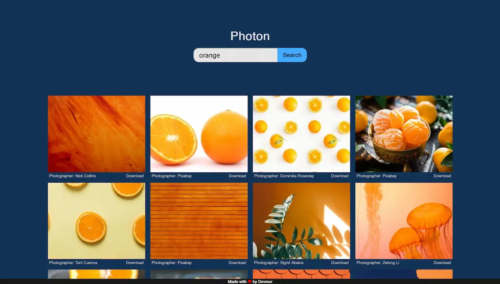

# Photon

Search photos on [Pexels](https://www.pexels.com/). High performance with no overhead.

Gallery is shown in a grid css system. There are many tiny animations for a nice visual user experience.

Here is in action:

If you wanna use this app, make sure to get your own api key on [Pexels API](https://www.pexels.com/api/).

> Note: If this app takes more that 5 seconds and nothing shows up after clicking *Search* or pressing *Enter* (on keyboard), this means your internet is restricted. Use a vpn of your choice.

Frameworkless development - Vanilla js - Enjoy!
